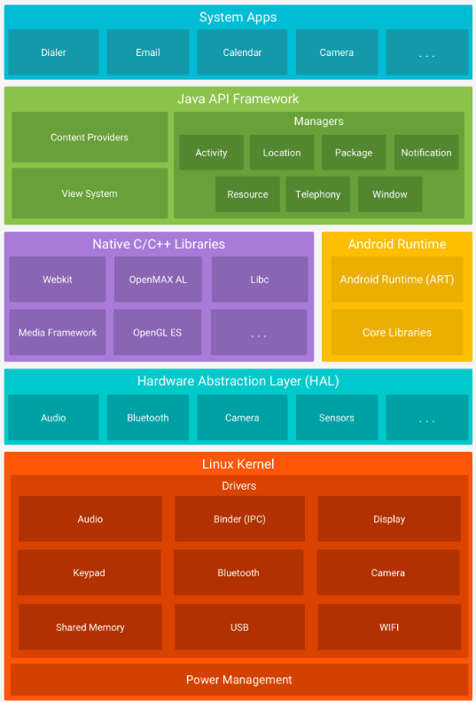
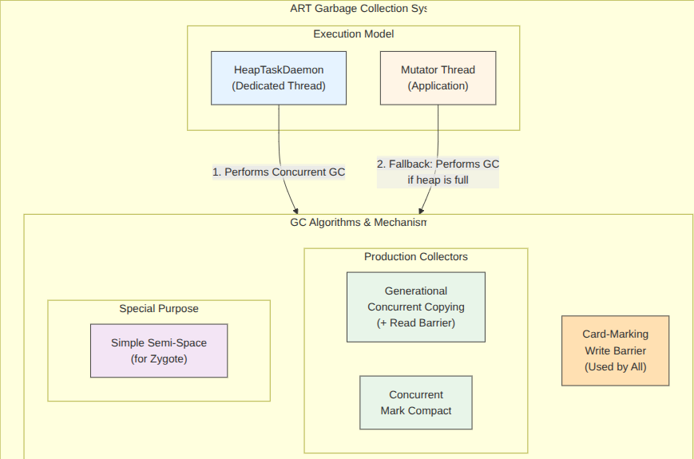
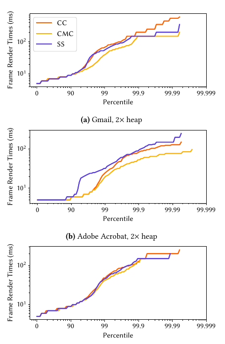
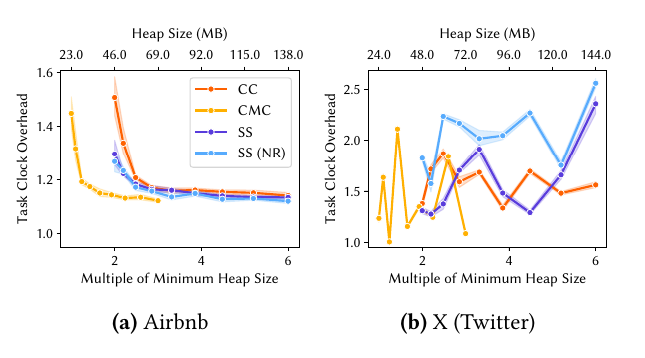

# INFO411 Memory Management on Mobile Devices
## ISMM 2024 – Memory Management on Mobile Devices

---

## Motivation

- 📱 Billions of mobile devices, yet memory management is understudied compared to servers/desktops.
- **Responsiveness (frame rate), energy (cpu/battery), and memory cost (heap size)** are critical to user experience.
- Android Runtime (ART), part of the **Android OS**, is:
  - Open-source
  - Garbage-collected
  - Runs across low- to high-end devices
- ❓How do OS garbage collectors behave on *real-world mobile apps*❓

<a href="#background" style="font-size: 2rem; text-decoration: none;">⬇️ Next</a>

---

## Background – ART Runtime

- **Android Runtime (ART):**
  - Zygote → forks every app process
  - Both **JIT** and **AOT** compilation available
  - Collectors: SemiSpace, Concurrent Copying, Concurrent Mark-Compact
- **OS level GC ≠ app-level GC**
  - Impacts *all apps* sharing the OS
  - Must measure **mutator cost** + **responsiveness**

---

## Architecture

---

## Challenges

- **Multi-tenancy**: Many apps/services share limited OS memory.
- **Lack of benchmarks**: No standard suite of open-source Android OS apps.
- **Non-determinism**: Network, GPS, UI events → reproducibility issues.
- **Heap size control**: Apps inherit from the OS Zygote → hard to tune per-app.
- **Heap introspection loops**: Apps adapt to OS memory pressure.
- **Closed-source apps**: Frequent updates + UI changes → flaky benchmarks.

❓How can OS-level GC overheads be measured in a *controlled & reproducible* way❓

---

## Framework Design – Key Principles

- **Heap size control**  
  - Hijacked **Zygote fork** to enforce per-app heap limits  
  - First systematic mechanism for OS-level GC evaluation  

- **GC cost attribution**  
  - Extended ART to log **GC phases**  
  - Collected **perf counters**:  
    - CPU cycles, Task clock 
    - **Instructions retired**
    - Page faults
  - Also measured wall-clock time, but discarded because *too noisy*  

---

## Framework Design – Key Principles

- **Responsiveness metrics**  
  - Measured **frame jank & render times** via `gfxinfo`  
  - User-visible latency, not just GC pause times  
  - **Percentiles (P50, P99, P99.9)** for frame times to capture stutter  

---

## Framework Design – Pipeline

**App → Modified ART → Mock APIs → UI Automator → Metrics**
- Controlled heap (size) configuration at fork
- Mocked heap introspection APIs → stable values
- Automated user events via **UI Automator**
- Logged GC timings + frame stability (Brief pause stutter)

---

## Framework Design – Challenges Addressed

- **Heap introspection feedback loops**  
  - Maps, Instagram adapt to “available memory”  
  - Solution: Fake responses via modified ART  

- **Non-determinism**  
  - Cached TikTok feeds & fixed content  
  - Forced **AOT compilation** → steady state  

- **Idempotent benchmarks**  
  - Cold-start every run  
  - Fixed app versions, reproducible UI scripts  

---

## Garbage Collection

---

## Cleaners (Collectors)

- **Generational Concurrent Copying Cleaner** 🧒
  - “Quick tidy-up kid”
  - Frequent, lightweight cleanups
  - Write barrier + read barrier ensure safety (references + movement + integrity)

---

## Cleaners (Collectors)

- **Concurrent Mark-Compact Cleaner** 🧓
  - “Deep-cleaning parent”
  - Less frequent, re-organizes heap
  - More space-efficient for long-lived workloads

---

## Benchmarks – Design

- **Vanilla Java benchmarks**  
  - DaCapo subset, GCBench  
  - Controlled, stable workloads  

- **Real-world apps**  
  - Gmail, TikTok, Instagram, Maps, Acrobat, Airbnb  
  - Represent actual OS-level stressors  

- Excluded: browsers & games (too dynamic, non-reproducible)

---

## Evaluation Framework

- Modified **ART** to:
  - Control heap per-app (Zygote fork)
  - Mock heap APIs (break feedback loops)
  - Automate UI input sequences
- ❓Can OS-level collectors be measured fairly for both **mutator cost** and **responsiveness**❓

---

## Evaluation – Methodology

- **Devices:** Pixel 7 Pro (12 GB), Pixel 4a 5G (6 GB)  
- **Controls:**  
  - Disabled SIM/Bluetooth/location  
  - Fixed CPU frequency, pinned cores  
  - Forced AOT warmup  
- **Lower Bound Overhead (LBO):**  
  - SemiSpace/NoGC as baselines  
  - Reported results = empirical *lower bounds* on GC cost  
- ⚖️ **CPU cycles reported slightly higher overhead than task clock** → apps did extra work, not just slowing  

---

## Evaluation – Vanilla Java Workloads

- **Optimized SemiSpace:** lowest mutator overheads (14–27%) / CPU Cycle / Task Clock ...  
- **Concurrent Copying (CC):** 10–23%, cache-friendly(less cache miss) at small heaps  
- **Concurrent Mark-Compact (CMC):** 11–32%, more space-efficient
- **Takeaway:** No single collector dominates  

---

## Evaluation – Real-World Apps

- Overheads: **2% – 51%**, strongly app + heap dependent  
- **Trends:**  
  - SemiSpace (optimized) → best for mutator overhead  
  - CMC → better for tight heaps (e.g., Maps)  
  - Pause times (short/frequent) ≠ responsiveness 

---

## Evaluation – Responsiveness

- Frame distributions (Gmail, Acrobat)  
  - P50, P99, P99.9 → smoothness vs jank  
  - 99.9th percentile → **stutter** despite short pause times  
- Insight: Must use **frame stability metrics**, not just stop-the-world pauses  
- Different apps show unique GC sensitivity patterns  

---

## Evaluation – Anomalies

- **Twitter/X:** highly unstable → discarded from results  
- **Google Maps:** minimum heap size changed **daily** with updates  
- ❗ Highlights difficulty of reproducibility with closed-source apps  

---

## Evaluation – Experimental Device

**Pixel 7 Pro**

| Component | Specification |
|-----------|---------------|
| CPU       | 2× Cortex-X1 @2.85GHz   2× Cortex-A78 @2.35GHz   4× Cortex-A55 @1.8GHz |
| Memory    | 12 GB LPDDR5 |

---

## Evaluation – Heap Sizes (Apps)

**Minimum Heap Sizes (MB)**

| Benchmark     | Pixel 7 Pro | Pixel 4a 5G |
|---------------|-------------|-------------|
| Acrobat       | 18          | 18 |
| Airbnb        | 23          | 23 |
| Discord       | 19          | 19 |
| Gmail         | 14          | 14 |
| Google News   | 14          | 17 |
| Maps          | 65          | 65 |

---

## Evaluation – Key Results

- GC overheads: **2% → 51%**  
- **SemiSpace (optimized):** best mutator overhead  
- **CMC:** most space-efficient  
- **Responsiveness metrics:**  
  - Pause times ≠ user experience  
  - **Frame stability (percentiles)** = better predictor

---

---

---

## Discussion – Time vs Space Tradeoff

- **SemiSpace:** low mutator cost, but higher heap demand  
- **CMC:** space-efficient, but overhead increases with workload  
- **Concurrent Copying:** good balance for smaller heaps  
- ❌ No universal best GC across workloads  

---

## Discussion – What Surprised

- SemiSpace often outperformed concurrent collectors  
- Pause time metrics failed as predictors of responsiveness  
- Closed-source app volatility (heap growth, updates) complicates research  

---

## Summary Takeaways

- **Framework:** First systematic GC evaluation for Android  
- **Evaluation:** Benchmarks across real apps + Java workloads  
- **Tradeoffs:** SemiSpace -> lowest overhead; CMC -> most space-efficient  
- **Responsiveness:** Frame stability (P50/P99/P99.9) > pause times  

---

## Future Improvements

- Build **open-source benchmark suite** for reproducibility  
- Stronger solutions to **heap introspection loops**  
- Improve reproducibility under **dynamic events**  
- Extend framework to **other mobile OSes**  
- Explore collectors optimizing **time-space tradeoffs** for small heaps  

❓What OS GC designs can sustain performance across *all tiers of devices*❓

